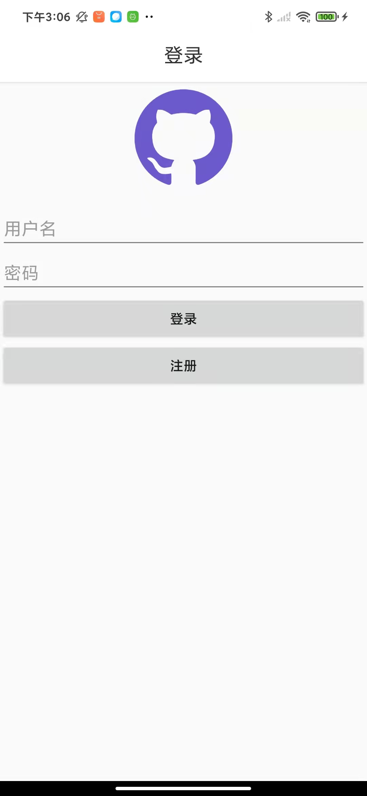
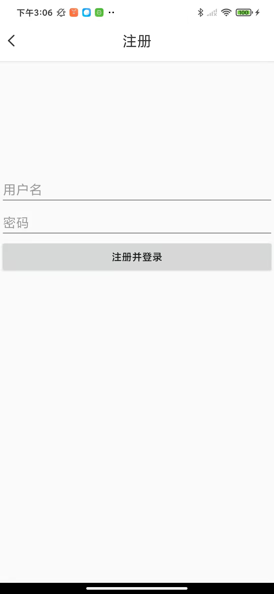
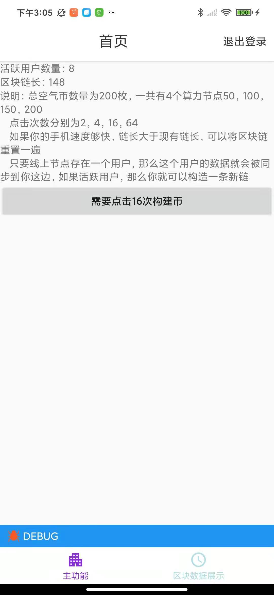
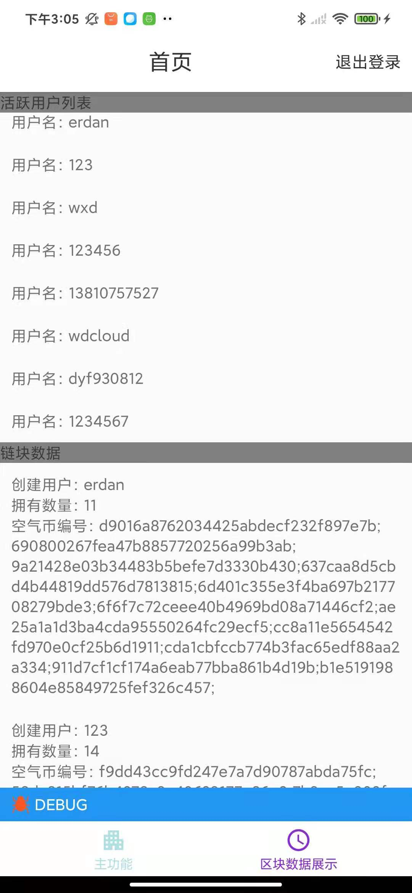

# Creative-Challenge-WTCoin
基于环信MQTT开发的区块链空气币项目

# 项目介绍：

该项目基于mqtt点对点数据传输基础上开发，运用区块链技术来实现数据完整与安全性（防篡改）

## 采用相关：

1. 采用环信IM用户系统，搭建用户登录与注册，并通过环信用户系统来构建用户数据

2. 采用环信mqtt服务

## 运行特点：

1. 数据全部存储在每个客户端上，通过mqtt来实时同步数据

2. 登录后数据会通过mqtt来认证数据完整与正确性

3. 用户登录构建登录数据会通过mqtt同步到全部客户端上

4. 用户点击创建区块链链块，会将构建新的链块，并通过mqtt同步到其他客户端上

5. 区块的创建是有一定的算力节点，依照链长来进行算力的分配。每达到一定的链长会增加算力值

使用说明：

安装包下载：
[wtcoin.apk](assets/com.kangaroo.wtcoin-release-v1.0.0-20210622170026L.apk)

测试账号：（采用环信IM系统）

- 账户名：erdan 密码：123

- 账户名：123 密码：123

- 账户名：123456 密码：123456

- 账户名：1234567 密码：123456

登陆后需要等待数据同步完成，才能进行下一步

图片说明：

登录页面：（输入账户名密码）

注册页面：（输入账户名密码，一键注册登录）

主功能页面 ： （可以通过点击按钮来实现创建区块）

数据页面 ： 用户数据，和链块数据实时查看

